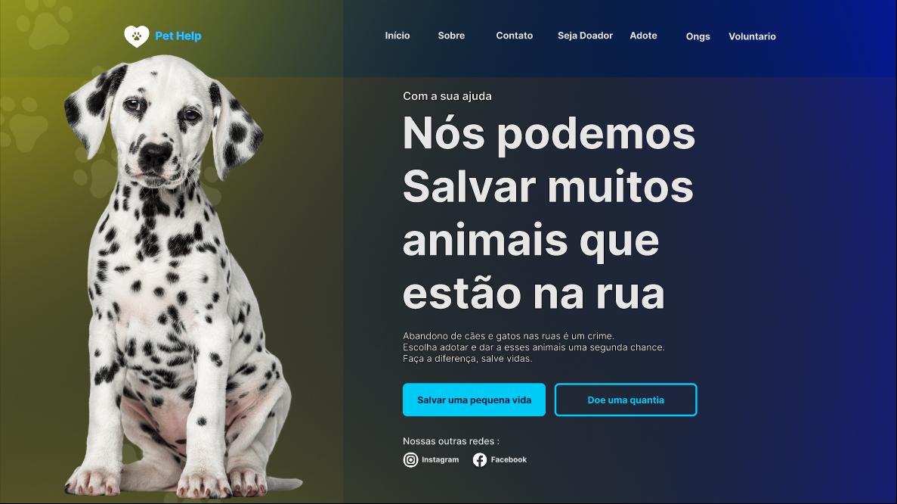

## PROJETO INTEGRADOR: DESENVOLVIMENTO DE SISTEMAS ORIENTADO A DISPOSITIVOS MÓVEIS E BASEADOS NA WEB

### 
2ª_entrega_Prova_Conceito 

#### 
 Quarto semestre TADS e TSI Segunda Etapa - SENAC-EAD 

|Integrantes|
|:-:|
|Amanda Silva Costa|
|Barbara Vargas da Silva|
|Eduardo Luis Ferreira Reis|
|Joicielle Rodrigues dos Santos|
|Lenita Maria Maciel de Almeida|
|Marcos Vinicius da Matta Pereira|
|Wellington James Monteiro da Silva|

**
 Tela de Landing Page 
**

# 
Orientações sobre o projeto.

#### [*link para o projeto prototipado no figma*](https://www.figma.com/file/COeng6h6d2scS4rAcoG7aG/Pet-Help?type=design&node-id=0%3A1&mode=design&t=IQr1n4B0g45DzxYb-1)

## Revisatação do Projeto Anterior.

* Foi revisitado o projeto anterior e notamos que o logo da landing page não estava seguindo o padrão do logo no aplicativo.
    * Efetuamos a alteração conforme imagem do <u>*Antes*</u> e <u>*Depois*</u> mostradas abaixo.

* Também foi visto que não haviamos previsto a tela de busca.
    * Prototipamos a tela no projeto no figma. Tema mostrada na <u>*imagem 3*</u>.

 
Antes

    

Depois

    

Imagem 3

  
 

    

## Preparação do Ambiente de Desenvolvimento do Projeto.

* Para esta etapa do projeto, utilizamos as seguintes tecnologias.
    * ##### No Front-End

        * HTML5 para estrururação de todo o conteudo.
        * CSS3 para estilização, posicionamento e adequaão do layout.
        * javascript

    * ##### No BackEnd

        * Java como linguagem para codificarmos a lógica do projeto.
        * SpringBoot como framework
        * SQL Server como sistema SGBD para aramazenagem dos dados.

    * ##### Ferramentas

        * Editor de código **vscode**
        * Ferramente de versionamento **git**
        * Plataforma de Hospedagem do código fonte **GitHub**

    * #### GitHub
         * O repositório do projeto pode ser encontrado no link do GitHub a seguir :  [*GitHub*](https://github.com/eduardoluisreis/PI_2_entrega_Prova_Conceito)

        